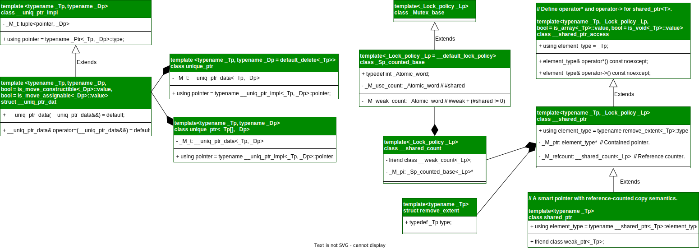

# JZOffer

- 易混辨析：

  - 子串一定是连续的，而子序列不一定是连续的

  - 组合：不强调元素顺序 $C(n, k) = n! / k!(n - k)!$

  - 排列：强调元素顺序 $A(n, k) = n! / (n - k)!$

0. **==快速排序就是个二叉树的前序遍历，归并排序就是个二叉树的后序遍历==**

    前序位置的代码在刚刚进入一个二叉树节点的时候执行；

    后序位置的代码在将要离开一个二叉树节点的时候执行；

    中序位置的代码在一个二叉树节点左子树都遍历完，即将开始遍历右子树的时候执行。

    前序位置的代码执行是自顶向下的，而后序位置的代码执行是自底向上的;

    前序位置的代码只能从函数参数中获取父节点传递来的数据，而后序位置的代码不仅可以获取参数数据，还可以获取到子树通过函数返回值传递回来的数据

1. 使用 `0x3F3F3F3F` 来替代最大值，防止运算过程中数值溢出
2. 迭代器的二分

    ```cpp
    std::vector<int> nums{1, 2, 3, 44, 54, 96, 124};
    auto k = std::lower_bound(nums.begin(), nums.end(), 56) - nums.begin();  // k = 5
    k = std::upper_bound(nums.begin(), nums.end(), 36) - nums.begin();  // k = 3
    ```

3. 小根堆

    ```cpp
    std::priority_queue<int> pq; // 默认大根堆
    std::priroity_queue<int, vector<int>, std::greater<int>> pq; // 小根堆
    ```

4. 字符串分割：利用字符流，将旧串`s`塞入流`ss`中，然后读入到新的字符串 `str` 中

    ```cpp
    std::string s = "hello my name is Lute~";
    std::stringstream ss(s);
    std::string str;
    std::vector<std::string> vec;
    while (ss >> str) vec.push_back(str);

    std::cout << vec.size() << std::endl;
    for (const auto& str : vec) {
        std::cout << str << "\n";
    } 
    ```

5. 四舍五入保留小数

    ```cpp
    char str[10];
    double num = 3.1415926;
    sprintf(str, "%.2f", num);
    string s = str;
    cout << s << endl;  // 3.14
    ```

6. 字符串按格式拆分

    ```cpp
    std::string str = "12:34@23";
    int u, v, w;
    sscanf(str.c_str(), "%d:%d@%d", &u, &v, &w);
    std::cout << "u = " << u << ", v = " << v << ", w = " << w << std::endl; // u = 12, v = 34, w = 23
    ```

7. 正则表达式

    ```cpp
    #include <algorithm>
    #include <iostream>
    #include <regex>
    #include <sstream>
    #include <string>
    using namespace std;

    int main() {
        std::cout << __FUNCTION__ << std::endl;

        // 目标串
        string str = "nums1=[12,23,4,9],nums2=[1,2,3],k=12";
        // 匹配模式
        regex r("(nums1=\\[)([0-9,]+)(\\],nums2=\\[)([0-9,]+)(\\],k=)(\\d+)");

        // 匹配结果
        string s1, s2;
        int k;

        for (sregex_iterator it(str.begin(), str.end(), r), end; it != end; ++it) {
            smatch match = *it;
            // for (size_t i = 0; i < match.size(); ++i) {
            //     cout << "i = " << i << ": " << match[i] << endl;
            // }
            // cout << match[2] << endl;
            s1 = match[2];
            // cout << match[4] << endl;
            s2 = match[4];
            // cout << match[6] << endl;
            k = stoi(match[6]);
        }

        // 根据 ',' 分割字符
        istringstream iss1(s1);
        istringstream iss2(s2);
        vector<int> nums1, nums2;
        string temp;
        while (getline(iss1, temp, ',')) nums1.push_back(stoi(temp));
        while (getline(iss2, temp, ',')) nums2.push_back(stoi(temp));

        // 验证结果
        for (const auto& num : nums1) cout << num << ", ";
        cout << endl;
        for (const auto& num : nums2) cout << num << ", ";
        cout << endl;
        cout << k << "\n";

        return 0;
    }
    ```

8. List

    ```cpp
    /**
    * @file mergeKLists.cc
    *
    * @brief 给你一个链表数组，每个链表都已经按升序排列
    *        请你将所有链表合并到一个升序链表中，返回合并后的链表
    * @link https://leetcode.cn/problems/merge-k-sorted-lists/description/
    *
    * @note 利用小根堆将 k 个链表的 head 节点排序（自定义排序）
    *       即可获得 k 个头节点中的最小节点
    *
    * @author https://github.com/lutianen
    * @copyright Copyright (c) 2023
    *  FOR STUDY AND RESEARCH SUPPORT ONLY
    */

    #include <iostream>
    #include <queue>
    #include <string>
    #include <vector>

    using namespace std;

    /**
    * Definition for singly-linked list.
    */
    struct ListNode {
        int val;
        ListNode* next;
        ListNode() : val(0), next(nullptr) {}
        ListNode(int x) : val(x), next(nullptr) {}
        ListNode(int x, ListNode* next) : val(x), next(next) {}
    };

    inline ListNode* createList(vector<int>& list) {
        if (list.empty()) return nullptr;
        ListNode* head = new ListNode(list[0]);
        ListNode* cur = head;
        for (size_t i = 1; i < list.size(); i++) {
            cur->next = new ListNode(list[i]);
            cur = cur->next;
        }
        return head;
    }

    inline void deleteList(ListNode* head) {
        if (head == nullptr) return;
        if (head->next != nullptr) deleteList(head->next);
        delete head;
    }

    inline void dispList(ListNode* head) {
        ListNode* cur = head;
        string str;
        while (cur != nullptr) {
            str += std::to_string(cur->val);
            if (cur->next != nullptr) str += " -> ";
            cur = cur->next;
        }
        std::cout << str << std::endl;
    }

    ListNode* mergeKLists(vector<ListNode*>& lists) {
        if (lists.empty()) return nullptr;

        auto cmp = [](ListNode* pa, ListNode* pb) { return pa->val > pb->val; };
        priority_queue<ListNode*, vector<ListNode*>, decltype(cmp)> pque(cmp);

        ListNode *dummy = new ListNode(-1), *curr = dummy;

        for (ListNode* list : lists) {
            if (list != nullptr) pque.push(list);
        }

        while (!pque.empty()) {
            ListNode* node = pque.top();
            pque.pop();
            curr->next = node;
            curr = curr->next;

            if (node != nullptr && node->next != nullptr) pque.push(node->next);
        }

        return dummy->next;
    }

    ListNode* reverse(ListNode* head) {
        if (head == nullptr) return nullptr;

        ListNode *prev = nullptr, *curr = head;
        while (curr != nullptr) {
            ListNode* next = curr->next;
            curr->next = prev;
            prev = curr;
            curr = next;
        }
        return prev;
    }

    /**
    * @brief Reverse List [a, b)
    */
    ListNode* reverse(ListNode* a, ListNode* b) {
        if (a == nullptr) return nullptr;

        ListNode *prev = nullptr, *curr = a;
        while (curr != b) {
            ListNode* next = curr->next;
            curr->next = prev;
            prev = curr;
            curr = next;
        }
        return prev;
    }

    ListNode* reverseKGroup(ListNode* head, int k) {
        if (head == nullptr) return nullptr;

        ListNode *a = head, *b = head;
        for (int i = 0; i < k; ++i) {
            if (b == nullptr) return head;
            b = b->next;
        }

        ListNode* newHead = reverse(a, b);
        a->next = reverseKGroup(b, k);

        return newHead;
    }

    /**
    * @brief 回文链表
    */
    bool isPalindrome(ListNode* head) {
        if (head == nullptr) return true;

        ListNode *slow = head, *fast = head;
        while (fast != nullptr && fast->next != nullptr) {
            slow = slow->next;
            fast = fast->next->next;
        }
        // fast != nullptr --->>> 链表为偶数个节点
        if (fast != nullptr) slow = slow->next;

        slow = reverse(slow);
        fast = head;

        while (slow != nullptr) {
            if (slow->val != fast->val) return false;
            slow = slow->next;
            fast = fast->next;
        }
        return true;
    }

    ListNode* deleteDuplicates(ListNode* head) {
        if (head == nullptr || head->next == nullptr) return head;

        ListNode *slow = head, *fast = head->next;
        while (fast != nullptr) {
            if (slow->val != fast->val) {
                slow = slow->next;
                slow->val = fast->val;
            }
            fast = fast->next;
        }

        // delete unused list node
        deleteList(slow->next);

        slow->next = nullptr;
        return head;
    }

    int main(int argc, char* argv[]) {
        {
            vector<int> listv1{1, 2, 3, 4, 5, 6, 8};
            vector<int> listv2{};
            vector<int> listv3{2, 4, 6, 8, 12, 37, 100};
            vector<ListNode*> lists;

            lists.push_back(createList(listv1));
            lists.push_back(createList(listv2));
            lists.push_back(createList(listv3));

            ListNode* head = mergeKLists(lists);
            dispList(head);

            deleteList(head);
        }

        {
            vector<int> listv1{1, 2, 3, 4, 5, 6, 8};
            ListNode* head = createList(listv1);
            head = reverse(head, nullptr);
            dispList(head);

            deleteList(head);
        }

        {
            vector<int> listv1{1, 2, 3,  4, 5, 6, 81, 2, 3, 4,
                            5, 6, 81, 2, 3, 4, 5,  6, 8};
            ListNode* head = createList(listv1);
            dispList(head);
            head = reverseKGroup(head, 4);
            dispList(head);

            deleteList(head);
        }

        {
            vector<int> l1{1, 2, 3, 4, 4, 3, 2, 1};
            ListNode* head = createList(l1);
            cout << isPalindrome(head) << endl;
            deleteList(head);

            vector<int> l2{1, 2, 3, 2, 1};
            head = createList(l2);
            cout << isPalindrome(head) << endl;
            deleteList(head);
        }

        {
            vector<int> l2{1, 2, 2, 2, 3, 3, 3, 3, 3, 3, 3, 4, 5, 6};
            ListNode* head = createList(l2);
            dispList(head);
            head = deleteDuplicates(head);
            dispList(head);
            deleteList(head);
        }

        return 0;
    }

    ```

9. 滑动窗口

    **==window[left, right) = nums[left, ..., right)，属于左闭右开的区间==**]

    ==使用该模板需要考虑以下问题？==

    - 什么时候应该移动 right 扩大窗口？窗口加入字符时，应该更新哪些数据？

    - 什么时候窗口应该暂停扩大，开始移动 left 缩小窗口？从窗口移出字符时，应该更新哪些数据？

    - 我们要的结果应该在扩大窗口时还是缩小窗口时进行更新

    [字符串中使相邻字符不相等的最少替换次数](https://www.geeksforgeeks.org/minimum-replacements-in-a-string-to-make-adjacent-characters-unequal/)

    ```cpp
    /**
     * @brief 统计使得字符串中相邻字符不同的最小操作次数
     *  思路：找到所有字符都相同的非重叠字符串，结果就是将每个子串长度一般的向取整之和
     * @param[in] str 待统计字符串
     * @return 最小操作次数
     */
    size_t countMinimun(const string& str) {
        int cnt = 0;  // 操作次数

        size_t i = 0;
        while (i < str.size()) {
            size_t j = i;
            // 查找相同字符构成的子串
            while (str[j] == str[i] && j < str.size()) ++j;

            // 相同字符子串的长度
            size_t diff = j - i;
            cnt += diff / 2;
            i = j;
        }
        return cnt;
    }
    ```

    ```cpp
        // 模板
        void slidingWindow(string& str) {
            // 用合适的数据结构记录窗口中的数据
            unordered_map<char, int> window;
    
            size_t left = 0, right = 0;
            while(right < str.size()) {
                // ch 是将移入窗口的字符，扩大窗口
                char ch = str[right++];
                window[ch]++;
                /* 进行窗口内数据的一些列更新 */
                // ...

                /** Debug 输出的位置 **/
                cout << "window: [" << left << ", " << right << ")" << endl;

                while(left < right && window needs shrink) {
                    // d 是将移出窗口的字符，缩小窗口
                    char d = str[left++];
                    window[d]--;
                    /* 进行窗口内数据的一些列更新 */
                    // ...
                }
            }
        }
    ```

    [最小覆盖子串](https://leetcode.cn/problems/minimum-window-substring)

    ```c++
    /** 两次对窗口内数据的更新操作是完全对称的 **/
    string minWindow(string& str, string& tar) {
        unordered_map<char, int> need, window;
        for (char ch : tar) ++need[ch];

        size_t left = 0, right = 0, valid = 0, start = 0, len = INT_MAX;
        while(right < str.size()) {
            char ch = str[right++];
            if (need.find(ch) != need.end()) {
                window[ch]++;
                if (need[ch] == window[ch]) ++valid;
            }

            while(valid == need.size()) {
                if (right - left < len) {
                    len = right - left;
                    start = left;
                }

                char de = str[left++];
                if (need.find(de) != need.end()) {
                    if (need[de] == window[de]) --valid;
                    --window[de];
                }
            }
        }

        return len == INT_MAX ? "" : str.substr(start, len);
    } 
    ```

    [字符串排列](https://leetcode.cn/problems/permutation-in-string/)

    ```cpp
    bool checkInclusion(string s1, string s2) {
        unordered_map<char, int> need, window;
        for (char ch : s1) ++need[ch];

        size_t left = 0, right = 0, valid = 0;
        while (right < s2.size()) {
            char ch = s2[right++];
            if (need.count(ch)) {
                ++window[ch];
                if (need[ch] == window[ch]) ++valid;
            }

            while (valid == need.size()) {
                if (right - left == s1.size()) return true;
                
                char d = s2[left++];
                if (need.count(d)) {
                    if (need[d] == window[d]) --valid;
                    --window[d];
                }
            }
        }

        return false;
    }
    ```

    [找到字符串中所有字母异位词](https://leetcode.cn/problems/find-all-anagrams-in-a-string/)

    ```cpp
    vector<int> findAnagrams(string s, string p) {
        vector<int> res;
        unordered_map<char, int> target, window;
        for (const char& ch : p) ++target[ch];

        size_t left = 0, right = 0, cnt = 0;
        while (right < s.size()) {
            char ch = s[right++];
            if (target.find(ch) != target.end()) {
                ++window[ch];
                if (target[ch] == window[ch]) ++cnt;
            }

            while (cnt == target.size()) {
                if (right - left == p.size()) res.push_back(left);

                char d = s[left++];
                if (target.find(d) != target.end()) {
                    if (target[d] == window[d]) --cnt;
                    --window[d];
                }
            }
        }
        return res;
    }
    ```

    [无重复字符的最长子串](https://leetcode.cn/problems/longest-substring-without-repeating-characters/)

10. Graph

    [图的遍历](https://leetcode.cn/problems/all-paths-from-source-to-target/)

    ```cpp
    /**
    * @brief
    * @link https://leetcode.cn/problems/all-paths-from-source-to-target/ @endlink
    * @param[in] graph  graph[i] 是一个从节点 i 可以访问所有节点的列表
    * @return
    */
    vector<vector<int>> allPathsSourceTarget(vector<vector<int>>& graph) {
        vector<vector<int>> paths;
        vector<int> path;
        // 总的节点个数
        int n = graph.size();

        // s 为当前节点
        function<void(int)> traverse = [&](int s) {
            path.push_back(s);

            if (s == n - 1) paths.emplace_back(path);

            for (int v : graph[s]) {
                traverse(v);
            }
            path.pop_back();
        };
        traverse(0);
        return paths;
    }
    ```

    **图中环的检测**

    [课程表](https://leetcode.cn/problems/course-schedule/)

    ```cpp
    vector<vector<int>> buildGraph(int numCourse,
                               vector<vector<int>>& prerequisites) {
        // graph 中共有 numCourse 个节点
        vector<vector<int>> graph = vector<vector<int>>(numCourse, vector<int>());

        // 添加边
        for (auto& edge : prerequisites) {
            int from = edge[0], to = edge[1];
            graph[from].push_back(to);
        }
        return graph;
    }

    bool DFS(int numCourse, vector<vector<int>>& prerequisites) {
        vector<bool> visited(numCourse, false);
        vector<bool> onPath(numCourse, false);
        vector<vector<int>> graph = buildGraph(numCourse, prerequisites);

        bool hasCycle = false;

        function<void(int)> traverse = [&](int s) {
            if (onPath[s]) {
                hasCycle = true;
                return;
            }
            if (visited[s] || hasCycle) return;

            visited[s] = true;
            onPath[s] = true;
            for (int k : graph[s]) {
                traverse(k);
            }
            onPath[s] = false;
        };

        for (size_t i = 0; i < graph.size(); ++i) {
            traverse(i);
        }
        return hasCycle;
    }
    ```

    **拓扑排序**

    DFS: **==逆后续遍历的结果，就是拓扑排序的结果==**，因为一个任务必须等到它依赖的所有任务都完成之后才能开始开始执行
        **DFS + onPath**

    [课程表 II](https://leetcode.cn/problems/course-schedule-ii)

    ```cpp
    /**
     * DFS: 将后序遍历的结果进行反转，就是拓扑排序的结果
     */
    vector<int> findOrder(int numCourses, vector<vector<int>>& prerequisites) {
        using edge = vector<int>;

        // Build graph
        function<vector<edge>()> buildGraph = [&]() {
            vector<edge> graph(numCourses, vector<int>());

            // from -> to 表示 to 节点依赖于 from 节点
            for (const auto& edge : prerequisites) {
                auto from = edge[0], to = edge[1];
                graph[from].push_back(to);
            }
            return graph;
        };
        vector<edge> graph = buildGraph();

        bool hasCycle = false;
        vector<bool> visited(numCourses, false);
        vector<bool> onPathed(numCourses, false);

        vector<int> order;

        function<void(int)> traverse = [&](int curr) {
            if (onPathed[curr]) hasCycle = true;
            if (visited[curr] || hasCycle) return;

            onPathed[curr] = true;
            visited[curr] = true;

            for (const auto& child : graph[curr]) traverse(child);
            order.push_back(curr);
            onPathed[curr] = false;
        };
        for (size_t i = 0; i < numCourses; ++i) traverse(i);

        if (hasCycle) return {};

        reverse(order.begin(), order.end());
        vector<int> res(order.begin(), order.begin() + numCourses);
        return res;
    }
    ```

    BFS: **==BFS + inDegree + queue==**

    inDegree 为 0 的节点入队，并执行 BFS 循环，不断弹出队列中的节点，减少相邻节点的入度，将入度为 0 的节点加入队列

    如果最终所有节点都被遍历过（cnt 等于节点数），则说明不存在环，否则存在环

    ==图的遍历 都需要 `visited` 数组防止走回头路，这里的 BFS 算法其实是通过 `indegree` 数组实现的 `visited` 数组的作用，只有入度为 0 的节点才能入队，从而保证不会出现死循环==

    ```cpp
    bool canFinish(int numCourses, vector<vector<int>>& prerequisites) {
        function<void(vector<vector<int>>&, vector<int>&)> buildGraph =
            [&](vector<vector<int>>& graph, vector<int>& inDegree) {
                for (const auto& edge : prerequisites) {
                    int from = edge[1], to = edge[0];
                    graph[from].push_back(to);
                    inDegree[to]++;
                }
            };

        // graph - 邻接表，graph[curr] 表示邻居节点
        vector<vector<int>> graph(numCourses, vector<int>());
        // inDegree[curr] - 表示 curr 当前节点的入度为 inDegree[curr]
        vector<int> inDegree(numCourses, 0);
        buildGraph(graph, inDegree);

        // 入度为 0 的节点入队
        queue<int> que;
        for (size_t i = 0; i < numCourses; ++i) {
            if (inDegree[i] == 0) que.push(i);
        }

        // 统计遍历的节点个数
        int cnt = 0;
        while (!que.empty()) {
            int curr = que.front();
            que.pop();
            cnt++;
            for (int child : graph[curr]) {
                --inDegree[child];
                if (inDegree[child] == 0) que.push(child);
            }
        }

        return cnt == numCourses;
    }
    ```

    ```cpp
    vector<int> findOrder_BFS(int numCourses, vector<vector<int>>& prerequisites) {
        function<void(vector<vector<int>>&, vector<int>&)> buildGraph =
            [&](vector<vector<int>>& graph, vector<int>& inDegree) {
                for (const auto& edge : prerequisites) {
                    int from = edge[1], to = edge[0];
                    graph[from].push_back(to);
                    ++inDegree[to];
                }
            };
        vector<vector<int>> graph(numCourses, vector<int>());
        vector<int> inDegree(numCourses, 0);
        buildGraph(graph, inDegree);

        queue<int> que;
        for (int i = 0; i < numCourses; ++i)
            if (inDegree[i] == 0) que.push(i);

        int cnt = 0;
        vector<int> res;
        while (!que.empty()) {
            int curr = que.front();
            que.pop();
            ++cnt;
            res.push_back(curr);

            for (const auto& child : graph[curr]) {
                --inDegree[child];
                if (inDegree[child] == 0) que.push(child);
            }
        }

        return cnt == numCourses ? res : vector<int>();
    }
    ```

    对于加权图的场景，我们需要优先级队列「自动排序」的特性，将路径权重较小的节点排在队列前面，以此为基础施展 BFS 算法，也就变成了 Dijkstra 算法

11. 单调队列

    [滑动窗口最大值](https://leetcode.cn/problems/sliding-window-maximum/)

    ```cpp
    /**
    * @brief 单调队列
    */
    class MonotonicQueue {
    public:
        void push(int val) {
            // 保持队列的单调性
            while (!dat_.empty() && dat_.back() < val) dat_.pop_back();
            dat_.push_back(val);
        }

        int max() { return dat_.front(); }

        void pop(int val) {
            if (val == dat_.front()) dat_.pop_front();
        }

    private:
        // 双端队列
        deque<int> dat_;
    };

    vector<int> maxSildingWindow(vector<int>& nums, in k) {
        MonotonicQueue window;
        vector<int> res;

        for (int i = 0; i < nums.size(); ++i) {
            if (i < k - 1) window.push(nums[i]);
            else {
                window.push(nums[i]);
                res.push_back(window.max());
                window.pop(nums[i - k + 1]);
            }
        }
        return res;
    }
    ```

12. 单调栈

    ```cpp
    vector<int> nextGreaterElement(vector<int>& nums) {
        size_t n = nums.size();
        vector<int> res(n);
        stack<int> stk;

        // 倒着往栈里放
        for (size_t i = n - 1; i >= 0; --i) {
            // 判定个子高矮
            while (!stk.empty() && stk.top() <= nums[i]) {
                // 矮个起开，反正也被挡着了
                stk.pop();
            }
            // nums[i] 身后的更大元素
            res[i] = stk.empty() ? -1 : stk.top();
            stk.push(nums[i]);
        }
        return res;
    }
    ```

13. 环形数组

    - **通过 `%` 运算符求模（余数），来模拟环形特效**
    - **数组长度翻倍**

    ```cpp
    vector<int> nextGreaterElements(vector<int>& nums) {
        int n = nums.size();
        vector<int> res(n);
        stack<int> stk;

        // 倒着往栈里放
        for (size_t i = 2 * n - 1; i >= 0; --i) {
            // 判定个子高矮
            while (!stk.empty() && stk.top() <= nums[i % n]) {
                // 矮个起开，反正也被挡着了
                stk.pop();
            }
            // nums[i] 身后的更大元素
            res[i % n] = stk.empty() ? -1 : stk.top();
            stk.push(nums[i % n]);
        }
        return res;
    }
    ```

14. 回溯

    - 组合问题：N个数里面按一定规则找出k个数的集合
    - 切割问题：一个字符串按一定规则有几种切割方式
    - 子集问题：一个N个数的集合里有多少符合条件的子集
    - 排列问题：N个数按一定规则全排列，有几种排列方式
    - 棋盘问题：N皇后，解数独等等

    ```cpp
    void backtace(vector<int>& nums, vector<bool>& used, vector<int>& path, vector<vector<int>>& res) {
        // base case, 达到叶子节点
        if (path.size() == nums.size()) {
            // 收集根到叶子节点路径上的值
            res.push_back(path);
            return;
        }

        for (int i = 0; i < nums.size(); ++i) {
            // 当前值已被加入到 path 中，跳过
            if (used[i]) continue;
            // 对于重复元素，跳过
            if (i > 0 && nums[i - 1] == nums[i] && !used[i - 1]) continue;

            // 选择
            path.push_back(nums[i]);
            used[i] = true;

            // 下一层
            backtrace(nums, used);

            // 恢复现场
            path.pop_back();
            used[i] = false;
        }
    }
    ```

15. 动态规划

    **==动态规划问题的一般形式就是求最值==, 重叠子问题、最优子结构、状态转移方程就是动态规划三要素**

    **递归算法的时间复杂度怎么计算？就是用子问题个数乘以解决一个子问题需要的时间**

    **动态规划的通用技巧：数学归纳思想**

    [斐波那契数列](https://leetcode.cn/problems/fibonacci-number/)

    ```cpp
    int fib(int n) {
        vector<size_t>dp (n + 1);
        if (n == 0) return 0;
        dp[0] = 0;
        dp[1] = 1;
        
        for (size_t i = 2; i <= n; ++i) {
            dp[i] = dp[i - 1] + dp[i - 2];
        }
        return dp[n];
    }    
    ```

    [零钱兑换](https://leetcode.cn/problems/coin-change/)

    ```cpp
    int coinChange(vector<int>& coins, int amount) {
        // 根据实际问题，所需的 coin 的数量，不可能超过 amount
        const int DEFAULT = amount + 1;
        // dp[i] 表示容量为 i 的背包所需 coin 的最少数量
        vector<int> dp(amount + 1, DEFAULT);
        dp[0] = 0;

        for (int i = 1; i <= amount; ++i) {
            for (int coin : coins) {
                if (i >= coin) dp[i] = min(dp[i], dp[i - coin] + 1);
            }
        }

        return dp[amount] == DEFAULT ? -1 : dp[amount];
    } 
    ```

    [最长递增子序列](https://leetcode.cn/problems/longest-increasing-subsequence/)

    ```cpp
    int lenghtOfLIS(vector<int>& nums) {
        if (nums.empty()) return 0;

        // dp[i] 表示以 nums[i] 结尾的最长递增子序列长度
        // vector<int> dp(nums.size());
        // for (auto& d : dp) d = 1;
        vector<int> dp(nums.size(), 1);

        for (size_t i = 1; i < nums.size(); ++i) {
            // 在
            for (size_t j = 0; j < i; ++j) {
                if (nums[j] < nums[i]) dp[i] = max(dp[j] + 1, dp[i]);
            }
        }
        return *max_element(dp.begin(), dp.end());
    }
    ```

    [下降路径最小和](https://leetcode.cn/problems/minimum-falling-path-sum/)

    ```cpp
    int minFallingPathSum(vector<vector<int>>& matrix) {
        if (matrix.empty()) return 0;

        // dp[i][j] 表示以 matrix[i][j] 为结尾时的下降路径最小和
        // dp[i][j] = matrix[i][j] + 
        //              min{ dp[i - 1][j - 1], dp[i - 1][j], dp[i - 1][j + 1] }
        vector<vector<int>> dp(matrix.size(), vector<int>(matrix[0].size(), 0));
        int rc = 0x3F3F3F3F;
        for (size_t j = 0; j < matrix[0].size(); ++j) dp[0][j] = matrix[0][j];

        function<int(int, int)> getDP = [&](int i, int j) {
            if (j < 0 || j >= matrix[i].size()) return 0x3F3F3F3F;
            return dp[i][j];
        };

        for (size_t i = 1; i < matrix.size(); ++i) {
            for (size_t j = 0; j < matrix[i].size(); ++j) {
                dp[i][j] =
                    matrix[i][j] + min(min(getDP(i - 1, j - 1), getDP(i - 1, j)),
                                    getDP(i - 1, j + 1));
            }
        }

        for (size_t j = 0; j < matrix[matrix.size() - 1].size(); ++j)
            rc = min(rc, dp[matrix.size() - 1][j]);

        return rc;
    }
    ```

    [单词拆分](https://leetcode.cn/problems/word-break/description/)

    ```cpp
    bool wordBreak(string s, vector<string>& wordDict) {
        // 动态规划 - 完全背包
        // dp[i] 表示以当前字符 s[i] 结尾时，能否满足条件
        vector<bool> dp(s.size() + 1, false);
        dp[0] = true;

        // 优化点：使用 set 加快查询速度
        unordered_set<string> uset(wordDict.begin(), wordDict.end());

        for (size_t i = 1; i <= s.size(); ++i) { // 遍历背包
            for (size_t j = 0; j < i; ++j) {    // 遍历物品
                if (dp[j] && uset.find(s.substr(j, i - j)) != uset.end())
                    dp[i] = true;
            }
        }

        return dp[s.size()];
    }
    ```

    [两个字符串的删除操作](https://leetcode.cn/problems/delete-operation-for-two-strings/)

    *删除之后，得到的结果就是最长公共子序列*

    ```cpp
    int minDistance_0(string word1, string word2) {
        if (word1.empty()) return word2.size();
        if (word2.empty()) return word1.size();

        // dp[i][j] 表示 word1[0,..i - 1] 和 word2[0,..j - 1] 操作的最小步数
        vector<vector<int>> dp(word1.size() + 1, vector<int>(word2.size() + 1));
        for (size_t i = 0; i <= word1.size(); ++i) dp[i][0] = i;
        for (size_t j = 0; j <= word2.size(); ++j) dp[0][j] = j;

        for (size_t i = 1; i <= word1.size(); ++i) {
            for (size_t j = 1; j <= word2.size(); ++j) {
                if (word1[i - 1] == word2[j - 1])
                    dp[i][j] = dp[i - 1][j - 1];
                else
                    dp[i][j] = 1 + min(dp[i][j - 1], dp[i - 1][j]);
            }
        }
        return dp[word1.size()][word2.size()];
    }
    ```

    [编辑距离](https://leetcode.cn/problems/edit-distance/)

    ```cpp
    int minDistance(string word1, string word2) {
        if (word1.empty()) return word2.size();
        if (word2.empty()) return word1.size();

        // dp[i][j] 表示 word1[0, .., i - 1] 转换成 word2[0, .., j - 1]
        //          所需要的最少操作数
        vector<vector<int>> dp(word1.size() + 1, vector<int>(word2.size() + 1));
        for (size_t i = 0; i <= word1.size(); ++i)
            dp[i][0] = i;
        for (size_t j = 0; j <= word2.size(); ++j)
            dp[0][j] = j;

        for (size_t i = 1; i <= word1.size(); ++i) {
            for (size_t j = 1; j <= word2.size(); ++j) {
                if (word1[i - 1] == word2[j - 1])
                    dp[i][j] = dp[i - 1][j - 1];
                else
                    // 在 删除、修改、添加 三种操作中选择最小值
                    dp[i][j] =
                        min(min(dp[i - 1][j], dp[i][j - 1]), dp[i - 1][j - 1]) + 1;
            }
        }
        return dp[word1.size()][word2.size()];
    }
    ```

    [最大子数组和](https://leetcode.cn/problems/maximum-subarray/)

    ```cpp
    int maxSubArray(vector<int>& nums) {
        if (nums.empty()) return 0;

        // dp[i] 表示以 num[i] 为结尾的连续子数组的最大和
        // dp[i] = max(nums[i], nums[i] + dp[i - 1])
        vector<int> dp(nums.size());
        dp[0] = nums[0];

        for (size_t i = 1; i < nums.size(); ++i) {
            dp[i] = max(nums[i], nums[i] + dp[i - 1]);
        }

        return *max_element(dp.begin(), dp.end());
    }   
    ```

    [最长公共子序列](https://leetcode.cn/problems/longest-common-subsequence/)

    ```cpp
    int longestCommonSubsequence(string text1, string text2) {
        if (text1.empty() || text2.empty()) return 0;

        // dp[i][j] 表示 text1[0,..i - 1] 和 text2[0,..j - 1] 的 LCS 长度
        vector<vector<int>> dp(text1.size() + 1, vector<int>(text2.size() + 1));

        for (size_t i = 1; i <= text1.size(); ++i) {
            char ch1 = text1[i - 1];
            for (size_t j = 1; j <= text2.size(); ++j) {
                char ch2 = text2[j - 1];
                if (ch1 == ch2)
                    dp[i][j] = dp[i - 1][j - 1] + 1;
                else
                    dp[i][j] = max(dp[i][j - 1], dp[i - 1][j]);
            }
        }
        return dp[text1.size()][text2.size()];
    }
    ```

16. 贪心
    [无重叠区间](https://leetcode.cn/problems/non-overlapping-intervals/)

    **动态规划**

    ```cpp
    /**
     * @brief 采用动态规划时，本质上是 “最长上升子序列” 问题
     *  即，找到最多的无重复区间
     */
    int eraseOverlapIntervals(vector<vector<int>>& intervals) {
        if (intervals.empty()) return 0;

        sort(
            intervals.begin(), intervals.end(),
            [](const vector<int>& u, const vector<int>& v) { return u[0] < v[0]; });

        // f[i] 表示以 i 区间为最后一个区间，可以选出的区间数量的最大值
        vector<int> f(intervals.size(), 1);
        for (size_t i = 1; i < intervals.size(); ++i) {
            for (size_t j = 0; j < i; ++j) {
                if (intervals[j][1] <= intervals[i][0]) f[i] = max(f[i], f[j] + 1);
            }
        }
        return intervals.size() - *max_element(f.begin(), f.end());
    }
    ```

    **贪心**

    ```cpp
    /**
    * @brief 计算最多有多少个互不交叠的区间
    * @param[in] intervals intervals[0] - start, intervals[1] - end
    * @return count
    */
    int countIntervals(vector<vector<int>>& intervals) {
        if (intervals.empty()) return 0;

        // 根据结束时间进行排序
        sort(
            intervals.begin(), intervals.end(),
            [](const vector<int>& a, const vector<int>& b) { return a[1] < b[1]; });

        // 至少有一个区间不相交
        int count = 1;

        // 当前区间的末尾
        int currEnd = intervals[0][1];
        for (const auto& interval : intervals) {
            int nextStart = interval[0];
            if (currEnd <= nextStart) {
                currEnd = interval[1];
                ++count;
            }
        }
        return count;
    }

    int eraseOverlapIntervals(vector<vector<int>>& intervals) {
        return intervals.size() - countIntervals(intervals);
    }
    ```

    [用最少数量的箭矢引爆气球](https://leetcode.cn/problems/minimum-number-of-arrows-to-burst-balloons/)

    ```cpp
    int findMinArrowShots(vector<vector<int>>& points) {
        if (points.empty()) return 0;

        sort(
            points.begin(), points.end(),
            [](const vector<int>& u, const vector<int>& v) { return u[1] < v[1]; });
        int cnt = 1, currEnd = points[0][1];
        for (const auto& point : points) {
            int nextStart = point[0];
            if (nextStart > currEnd) {
                currEnd = point[1];
                ++cnt;
            }
        }
        return cnt;
    }
    ```

    [跳跃游戏](https://leetcode.cn/problems/jump-game/)

    ```cpp
    bool canJump(vector<int>& nums) {
        if (nums.empty()) return true;

        size_t cover = 0;
        for (size_t i = 0; i <= cover; ++i) {
            cover = max(cover, nums[i] + i);
            if (cover >= nums.size() - 1) return true;
        }

        return false;
    }
    ```

    [视频拼接](https://leetcode.cn/problems/video-stitching/)

    ```cpp
    int videoStitching(vector<vector<int>>& clips, int time) {
        if (time <= 0) return -1;

        // 起点排序，起点相同时按右端点降序排序
        sort(clips.begin(), clips.end(), [](vector<int>& u, vector<int>& v) {
            return u[0] == v[0] ? u[1] < v[1] : u[0] < v[0];
        });

        // currEnd, nextEnd, Count
        int ced = 0, ned = 0, cnt = 0;
        size_t i = 0;
        while (i < clips.size() && clips[i][0] <= ced) {
            // 当 多个下一区间左端点 位于 当前区间右端点 内部时，找到最大的右端点
            while (i < clips.size() && clips[i][0] <= ced) {
                ned = max(ned, clips[i][1]);
                ++i;
            }
            ced = ned;
            ++cnt;

            // 类似于跳跃游戏，已经能够满足要求，跳出循环
            if (ced >= time) return cnt;
        }
        return -1;
    }
    ```

17. 多线程

    **线程创建与销毁耗时对比: \<thread> vs <pthread.h>**

    ```cpp
    // C++ 标准库中的 thread 库
    #include <benchmark/benchmark.h>
    #include <thread>

    void BM_for(benchmark::State& bm) {
        for (auto _:bm) {
            std::thread t1([](){
            });
            t1.join();
        }
    }
    BENCHMARK(BM_for);
    BENCHMARK_MAIN();

    /*
        2023-09-08T14:40:17+08:00
        Run on (16 X 4600 MHz CPU s)
        CPU Caches:
        L1 Data 48 KiB (x8)
        L1 Instruction 32 KiB (x8)
        L2 Unified 1280 KiB (x8)
        L3 Unified 24576 KiB (x1)
        Load Average: 3.26, 2.91, 2.36
        ***WARNING*** CPU scaling is enabled, the benchmark real time measurements may be noisy and will incur extra overhead.
        -----------------------------------------------------
        Benchmark           Time             CPU   Iterations
        -----------------------------------------------------
        BM_for          14138 ns         8664 ns        71463
    */

    ```

    ```cpp
    // Linux 中的 pthread 库
    #include <benchmark/benchmark.h>
    #include <pthread.h>

    void* threadFunc (void*) { return nullptr; }

    void BM_for(benchmark::State& bm) {
        for (auto _:bm) {
            pthread_t pid;
            pthread_create(&pid, nullptr,
                threadFunc, nullptr);

            pthread_join(pid, nullptr);
        }
    }
    BENCHMARK(BM_for);
    BENCHMARK_MAIN();

    /*
        2023-09-08T14:45:26+08:00
        Run on (16 X 4600 MHz CPU s)
        CPU Caches:
        L1 Data 48 KiB (x8)
        L1 Instruction 32 KiB (x8)
        L2 Unified 1280 KiB (x8)
        L3 Unified 24576 KiB (x1)
        Load Average: 2.63, 2.55, 2.34
        ***WARNING*** CPU scaling is enabled, the benchmark real time measurements may be noisy and will incur extra overhead.
        -----------------------------------------------------
        Benchmark           Time             CPU   Iterations
        -----------------------------------------------------
        BM_for          13346 ns         8402 ns        72869
    */
    ```

    **`n` 个线程交替打印本线程 ID（0～n-1），重复打印 `m` 次**

    ```cpp
    #include <atomic>
    #include <iostream>
    #include <thread>
    #include <vector>
    using namespace std;

    atomic_int g_cnt{0};
    atomic_int g_m{0};
    vector<thread> g_threads;

    int main() {
        int n = 4;
        int m = 2;
        g_m.store(m);

        for (int i = 0; i < n; ++i)
            g_threads.push_back(thread(
                [](int threadId) {
                    while (g_m.load() > 0) {
                        if (g_cnt.load() == threadId) {
                            cout << threadId << endl;
                            g_cnt.fetch_add(1);
                            if (g_cnt.load() == 4) {
                                g_m.fetch_sub(1);
                                g_cnt = 0;
                            }
                        }
                    }
                },
                i));

        for (auto& t : g_threads) t.join();
        return 0;
    }
    ```

18. 智能指针

    **unique_ptr**

    底层是一个`tuple`，存储的是`指针`和对应的`Deleter`

    

    **shared_ptr**

    底层是两根指针，一根指向资源，一根指向原子变量的引用计数；

    ```cpp
    // STL
    void deleterFunc(char* p) { delete p; }
    int main() {
    auto deleterLambda = [](char* p) { delete p; };
    std::unique_ptr<char, decltype(deleterLambda)> p_ch_1(new char,
                                                            deleterLambda);
    std::unique_ptr<char, decltype(&deleterFunc)> p_ch_2(new char, &deleterFunc);

    std::cout << sizeof(&deleterFunc) << ", " << sizeof(deleterLambda) << ", "
                << sizeof(p_ch_1) << ", " << sizeof(p_ch_2) << std::endl;
    }

    // Lute
    namespace Lute {
    template <typename T>
    class unique_ptr {
        pointer ptr_;

    public:
        using pointer = T*;

        explicit unique_ptr(pointer ptr = nullptr) : ptr_(ptr) {}

        unique_ptr(const unique_ptr&) = delete;
        unique_ptr& operator=(const unique_ptr&) = delete;

        unique_ptr(unique_ptr&& ptr) noexcept { ptr_ = ptr.release(); }
        unique_ptr& operator=(unique_ptr&& ptr) noexcept {
            reset(ptr.release());
            return *this;
        }

        ~unique_ptr() { delete ptr_; }

        void reset(pointer p = nullptr) {
            auto saved_ptr = ptr_;
            ptr_ = p;
            delete saved_ptr;
        }
        pointer release() {
            auto p = ptr_;
            ptr_ = nullptr;
            return p;
        }
        pointer get() const { return ptr_; }

        T& operator*() const { return *ptr_; }
        pointer operator->() const { return ptr_; }

        explicit operator bool() const { return ptr_; }
    };
    }  // namespace Lute
    ```
